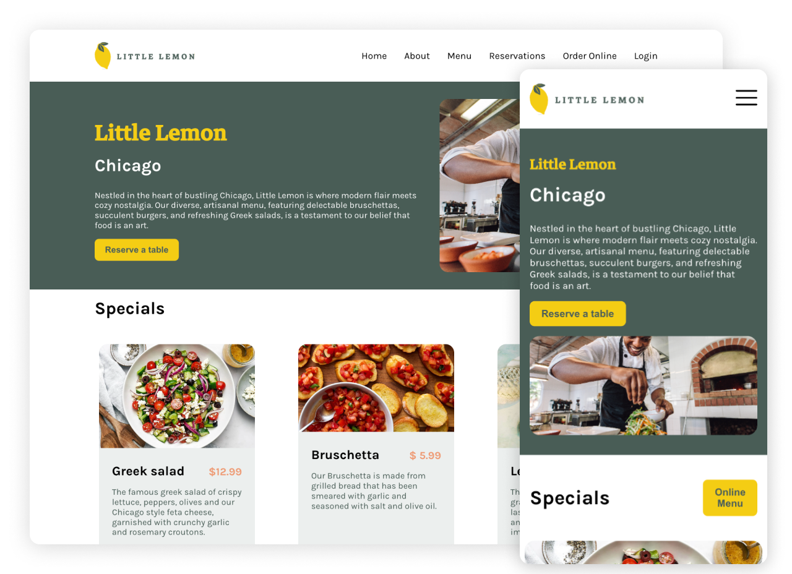

# Little Lemon Restaurant Website :lemon:   Meta Frontend Developer Capstone Project [Link](https://www.coursera.org/professional-certificates/meta-front-end-developer)

This repo features the capstone project for the frontend developer certificate by meta. The project is built in react. Only the homepage and reservation pages are finished, the rest isn't part of the course.

## Features

- Responsive Webdesign: Navigation & Content
- Reserve a table using an interactive form
- Get reservation feedback with a popup component

## Available Scripts

In the project directory, you can run:

### `npm install`

The npm install command is used to install all the dependencies defined in your project's package.json file.

### `npm start`

Runs the app in development mode.\
Open [http://localhost:3000](http://localhost:3000) to view it in your browser.

### `npm test`

Launches the test runner.
It runs all the tests for the application and provides feedback on their status.
The test files are typically have a .test.js extension.
